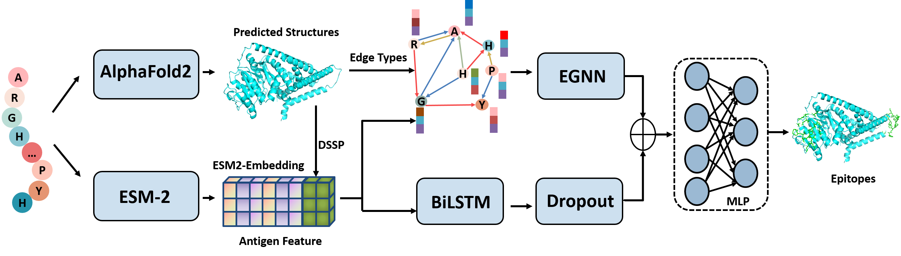

# Intro  
GraphBepi is a novel graph-based method for accurate B-cell epitope prediction, which is able to capture
spatial information using the predicted protein structures through the edge-enhanced deep graph neural network.

We recommend you to use the [web server](http://bio-web1.nscc-gz.cn/apps) of GraphBepi
if your input is small.  





# System requirement  
GraphBepi is developed under Linux environment with:  
- python  3.9.12  
- numpy  1.21.5
- pandas  1.4.2
- fair-esm  2.0.0
- torch  1.12.1
- pytorch-lightning  1.6.4
- (optional) esmfold
# Software requirement  
To run the full & accurate version of GraphBepi, you need to make sure the following software is in the [mkdssp](./mkdssp) directory:  
[DSSP](https://github.com/cmbi/dssp) (*dssp ver 2.0.4* is Already in this repository) 

# Build dataset  
1. `git clone https://github.com/biomed-AI/GraphBepi.git && cd GraphBepi`
2. `python dataset.py --gpu 0`

It will take about 20 minutes to download the pretrained ESM-2 model and an hour to build our dataset with CUDA.
# Run GraphBepi for training
After build our dataset ***BCE_633***, train the model with default hyper params:
```
python train.py --dataset BCE_633
```
# Run GraphBepi for prediction  
For sequences in fasta file:  
```
python test.py -i fasta_file -f --gpu 0 -o ./output
```
For a protein structure in PDB file:  
```
python test.py -i pdb_file -p --gpu 0 -o ./output
```


# Web server, citation and contact  
The GraphPPIS web server is freely available:  [interface](http://bio-web1.nscc-gz.cn/apps)  

Citation:  
```

@article{zengys,
  title={Identifying the B-cell epitopes using AlphaFold2 predicted structures and pretrained language model},
  author={Yuansong Zeng, Zhuoyi Wei, Qianmu Yuan, Sheng Chen, Weijiang Yu, Jianzhao Gao, and Yuedong Yang},
  journal={biorxiv},
  year={2022}
 publisher={Cold Spring Harbor Laboratory}
}

```

Contact:  
Zhuoyi Wei (weizhy8@mail2.sysu.edu.cn)
Yuansong Zeng (zengys@mail.sysu.edu.cn)    


